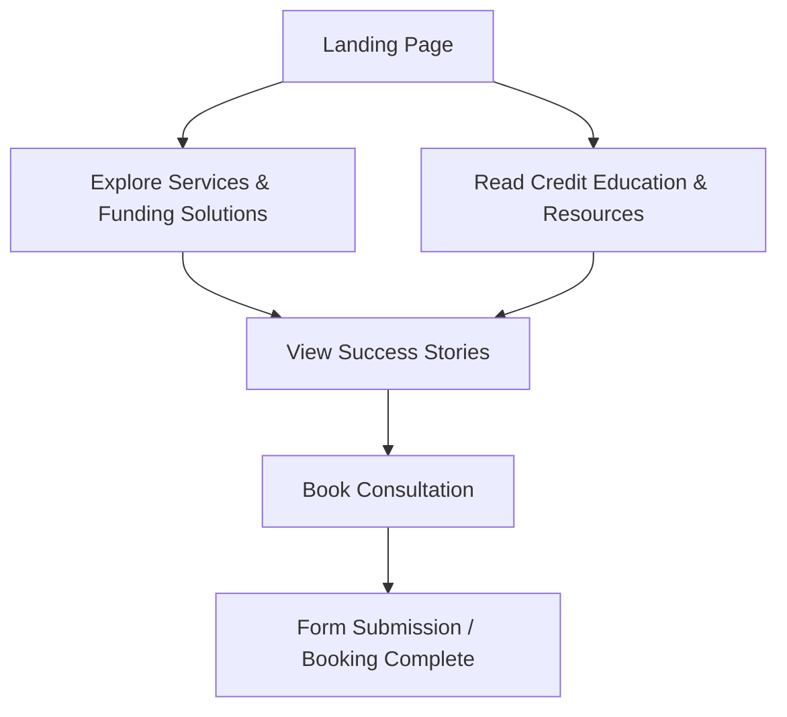

## 1. Product Overview
KBrown Consultant is a premium financial consulting brand helping people with funding opportunities, financial education, credit education, and business growth through compliant educational content.
- Main Purpose: Provide compliant, educational financial consulting and business growth strategies.
- Target Value: Position the brand as an ultra-modern, luxury FinTech service with an "Apple Level UI" and seamless interactions.

## 2. Core Features

### 2.1 User Roles
| Role | Registration Method | Core Permissions |
|------|---------------------|------------------|
| Visitor | N/A | Browse content, view resources, book consultations |

### 2.2 Feature Module
1. **Home**: Hero section, Trusted By, Services, Funding Process, Educational Resources, Why Choose Us, Success Metrics, Testimonials, Featured eBooks, Latest Resources, FAQ, Consultation CTA.
2. **About**: Company background, mission, team.
3. **Funding Solutions**: Guidance on funding opportunities and strategies.
4. **Credit Education**: Educational content on credit management.
5. **Resources & eBooks**: Downloadable educational materials.
6. **Success Stories & Testimonials**: Client metrics and reviews.
7. **FAQ**: Accordion-style frequently asked questions.
8. **Book Consultation**: Form/integration for booking.
9. **Contact**: Premium contact form.
10. **Legal**: Privacy Policy, Terms, Disclaimer.

### 2.3 Page Details
| Page Name | Module Name | Feature description |
|-----------|-------------|---------------------|
| Home | Hero section | Animated particles, gradient mesh, blur circles, text reveal |
| Home | Services | Service Cards with 3D tilt and hover glow |
| Global | Navbar | Transparent, glass effect, scroll hide, mega menu, sticky |
| Global | Footer | Newsletter, quick links, floating back to top |

## 3. Core Process
The user lands on the website, explores premium FinTech consulting services, consumes educational resources, and eventually books a personalized consultation.

## 4. User Interface Design

### 4.1 Design Style
- **Theme**: Dark Theme with Gold Accent.
- **Primary Dark**: `#0B1523`
- **Secondary Navy**: `#13243D`
- **Primary Gold**: `#D4AF37`
- **Light Gold**: `#F2C96D`
- **Gray**: `#6D6E71`
- **White**: `#F5F6F8`
- **Typography**: Playfair Display (Heading), Inter (Body), Space Grotesk (Numbers), Inter SemiBold (Buttons).
- **Style Elements**: Ultra Modern, Luxury, Clean, FinTech, Apple Level UI, Stripe Animations, Smooth Motion, Glassmorphism (minimal).

### 4.2 Page Design Overview
| Page Name | Module Name | UI Elements |
|-----------|-------------|-------------|
| All Pages | Global | Custom cursor, page loader, smooth page transition, noise overlay |
| Home | Hero | Moving golden lines, floating glow, premium lighting, animated statistics |
| Various | Cards | Gradient border cards, glass cards, 3D cards, magnetic hover |

### 4.3 Responsiveness
Desktop-first, mobile-adaptive. Supports Desktop, Laptop, Tablet, Mobile, Ultra Wide.

### 4.4 3D Scene Guidance
- Implement `@react-three/fiber` and `@react-three/drei` for subtle 3D elements (e.g., hero background or floating objects).
- Environment should be dark and moody with premium lighting reflecting off gold elements.
- Interactions include scroll progress, magnetic buttons, cursor follow, image zoom, card tilt, and 3D rotation.

## 5. Compliance Rules
- Position as: Financial Consulting, Business Growth, Funding Guidance, Educational Resources.
- Prohibited Terms: "We fix your credit", "Guaranteed approval", "Guaranteed funding", "Increase your score", "Fast approvals".
