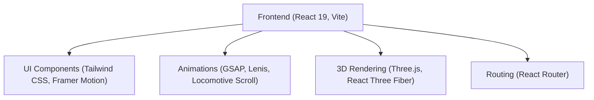

## 1. Architecture Design

## 2. Technology Description
- **Frontend**: React@19 + Tailwind CSS + Vite + TypeScript
- **State/Hooks**: `react-use`, `usehooks-ts`
- **Routing**: `react-router-dom`
- **Animations**: `framer-motion`, `gsap`, `@gsap/react`, `lenis`, `locomotive-scroll`, `aos`, `split-type`, `motion`, `matter-js`, `@react-spring/web`
- **3D**: `three`, `@react-three/fiber`, `@react-three/drei`, `@react-three/postprocessing`
- **UI Libraries**: `lucide-react`, `clsx`, `tailwind-merge`, `react-icons`, `react-hot-toast`, `sonner`, `react-spinners`, `react-loading-skeleton`, `lottie-react`, `@studio-freight/hamo`
- **Utilities**: `date-fns`, `zod`, `react-hook-form`, `@hookform/resolvers`
- **Components**: `react-countup`, `react-intersection-observer`, `react-parallax-tilt`, `react-fast-marquee`, `swiper`, `embla-carousel-react`, `react-player`, `react-scroll`

## 3. Route Definitions
| Route | Purpose |
|-------|---------|
| `/` | Home page |
| `/about` | About the brand |
| `/funding-solutions` | Funding guidance |
| `/credit-education` | Educational content |
| `/resources` | General resources |
| `/ebooks` | Downloadable eBooks |
| `/success-stories` | Testimonials and metrics |
| `/faq` | Frequently asked questions |
| `/book-consultation` | Booking flow |
| `/contact` | Contact form |
| `/privacy-policy` | Legal privacy policy |
| `/terms` | Legal terms of service |
| `/disclaimer` | Legal disclaimer |
| `*` | 404 Error Page |

## 4. Folder Structure
- `src/components/`
- `src/layout/`
- `src/sections/`
- `src/pages/`
- `src/animations/`
- `src/hooks/`
- `src/context/`
- `src/assets/`
- `src/fonts/`
- `src/images/`
- `src/videos/`
- `src/icons/`
- `src/lottie/`
- `src/styles/`
- `src/utils/`
- `src/constants/`
- `src/data/`
- `src/services/`
- `src/routes/`
- `src/ui/`
